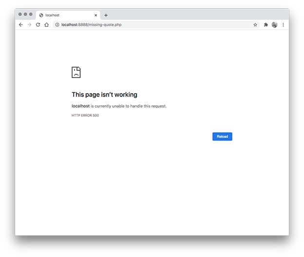
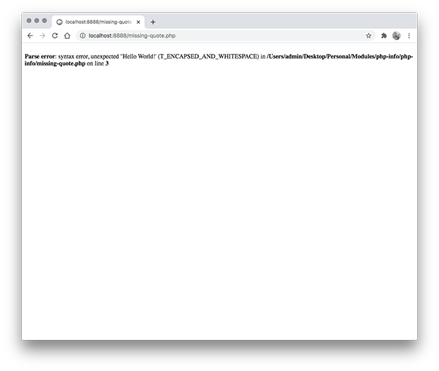
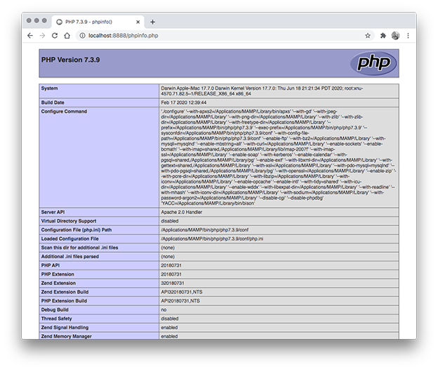
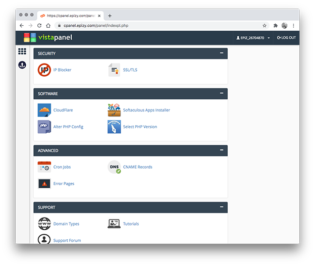

# Using the phpinfo Function

When you're coding PHP, debugging can be difficult. By default when a PHP error occues your browser will likely display a `This pags isn't working` message. This message is not too helpful.

There are a handful of methods to have PHP display a much more descriptive error.

## MAMP/WAMP

If you are using a local server you will need to chagne your `php.ini` file. First you need to locate this file. Place the provided `phpinfo.php` file in your server root and test. It will list all of your PHP settings.

Locate the `Loaded Configuration File` setting note where the `php.ini` files is located. Mine is located in the `/Applications/MAMP/bin/php/php7.3.9/conf/php.ini` folder. Open this file, find the line that says `display_errors = Off` and change it to `display_errors = On`.

Save and restart your server.

## PHP Hosting

If you are using hosting to test your PHP files you can change the same setting using your hosting control panel. Log in to your hosting control panel and look for a group of PHP related options. With Infinity Free hosting it's called `Alter PHP config`.

Once you are in the PHP settings look for an option related to displaying PHP errors, turn it on, and refresh your page.

---

## Repo Resources

- [Visual Studio Code](https://code.visualstudio.com/)
- [Filezilla](https://filezilla-project.org/)

 

